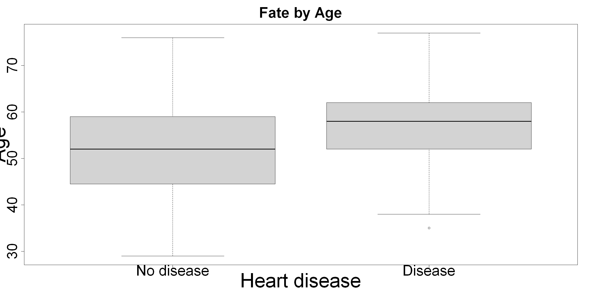
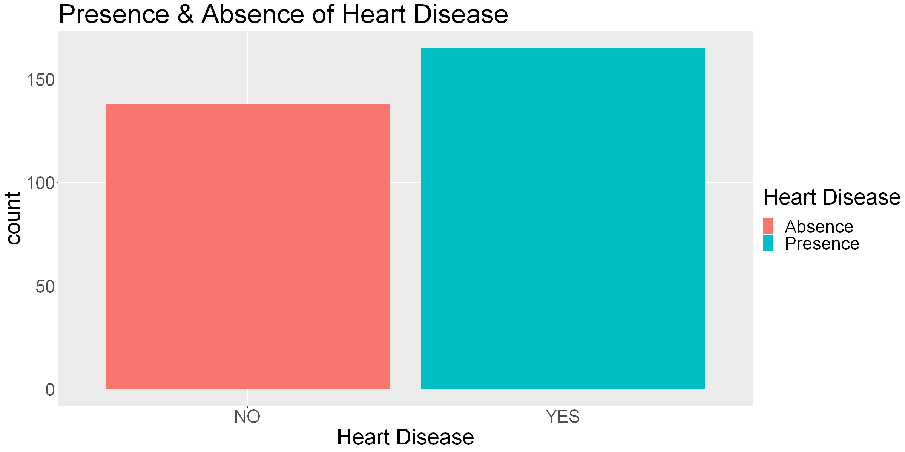
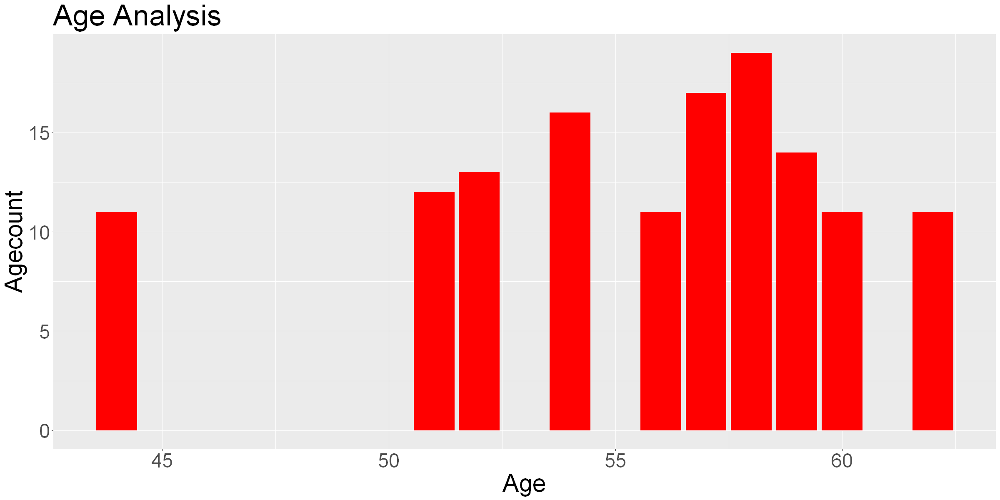
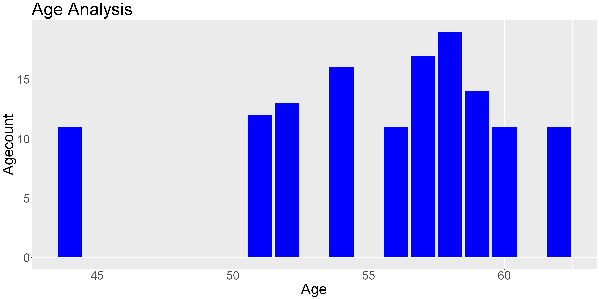
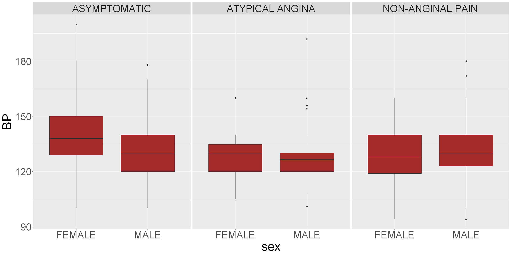
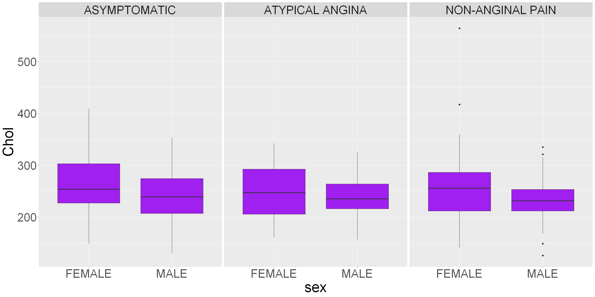
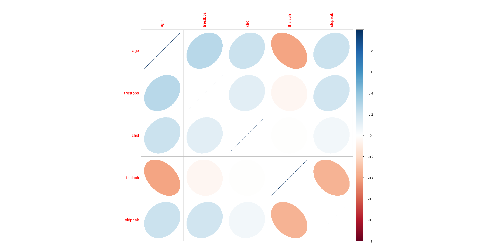

# Title : Heart Disease Prediction using R
## Author : Abhishek Chauhan 
## ID : MCS21024
## ```````````````````````````````````````````````````````````````````````

# Installing packages


```R
install.packages("tidyverse")
install.packages("repr")
install.packages("corrplot")
install.packages("ggplot2")
install.packages("pROC")
install.packages("kernlab")
```

    Warning message:
    "package 'tidyverse' is in use and will not be installed"
    Warning message:
    "package 'repr' is in use and will not be installed"
    Warning message:
    "package 'corrplot' is in use and will not be installed"
    Warning message:
    "package 'ggplot2' is in use and will not be installed"
    Warning message:
    "package 'pROC' is in use and will not be installed"
    Warning message:
    "package 'kernlab' is in use and will not be installed"
    

# Loading libraries


```R
library(tidyverse)
library(repr)
library(corrplot)
library(ggplot2)
library(pROC)
library(kernlab)
```

# Data Preparation


```R
heart.data <- read.csv("heart.csv")
```

## Exploring data


```R
head(heart.data)
```


<table class="dataframe">
<caption>A data.frame: 6 × 14</caption>
<thead>
	<tr><th></th><th scope=col>age</th><th scope=col>sex</th><th scope=col>cp</th><th scope=col>trestbps</th><th scope=col>chol</th><th scope=col>fbs</th><th scope=col>restecg</th><th scope=col>thalach</th><th scope=col>exang</th><th scope=col>oldpeak</th><th scope=col>slope</th><th scope=col>ca</th><th scope=col>thal</th><th scope=col>target</th></tr>
	<tr><th></th><th scope=col>&lt;int&gt;</th><th scope=col>&lt;int&gt;</th><th scope=col>&lt;int&gt;</th><th scope=col>&lt;int&gt;</th><th scope=col>&lt;int&gt;</th><th scope=col>&lt;int&gt;</th><th scope=col>&lt;int&gt;</th><th scope=col>&lt;int&gt;</th><th scope=col>&lt;int&gt;</th><th scope=col>&lt;dbl&gt;</th><th scope=col>&lt;int&gt;</th><th scope=col>&lt;int&gt;</th><th scope=col>&lt;int&gt;</th><th scope=col>&lt;int&gt;</th></tr>
</thead>
<tbody>
	<tr><th scope=row>1</th><td>63</td><td>1</td><td>3</td><td>145</td><td>233</td><td>1</td><td>0</td><td>150</td><td>0</td><td>2.3</td><td>0</td><td>0</td><td>1</td><td>1</td></tr>
	<tr><th scope=row>2</th><td>37</td><td>1</td><td>2</td><td>130</td><td>250</td><td>0</td><td>1</td><td>187</td><td>0</td><td>3.5</td><td>0</td><td>0</td><td>2</td><td>1</td></tr>
	<tr><th scope=row>3</th><td>41</td><td>0</td><td>1</td><td>130</td><td>204</td><td>0</td><td>0</td><td>172</td><td>0</td><td>1.4</td><td>2</td><td>0</td><td>2</td><td>1</td></tr>
	<tr><th scope=row>4</th><td>56</td><td>1</td><td>1</td><td>120</td><td>236</td><td>0</td><td>1</td><td>178</td><td>0</td><td>0.8</td><td>2</td><td>0</td><td>2</td><td>1</td></tr>
	<tr><th scope=row>5</th><td>57</td><td>0</td><td>0</td><td>120</td><td>354</td><td>0</td><td>1</td><td>163</td><td>1</td><td>0.6</td><td>2</td><td>0</td><td>2</td><td>1</td></tr>
	<tr><th scope=row>6</th><td>57</td><td>1</td><td>0</td><td>140</td><td>192</td><td>0</td><td>1</td><td>148</td><td>0</td><td>0.4</td><td>1</td><td>0</td><td>1</td><td>1</td></tr>
</tbody>
</table>


```R
dim(heart.data)
```


<style>
.list-inline {list-style: none; margin:0; padding: 0}
.list-inline>li {display: inline-block}
.list-inline>li:not(:last-child)::after {content: "\00b7"; padding: 0 .5ex}
</style>
<ol class=list-inline><li>303</li><li>14</li></ol>


```R
tail(heart.data)
```


<table class="dataframe">
<caption>A data.frame: 6 × 14</caption>
<thead>
	<tr><th></th><th scope=col>age</th><th scope=col>sex</th><th scope=col>cp</th><th scope=col>trestbps</th><th scope=col>chol</th><th scope=col>fbs</th><th scope=col>restecg</th><th scope=col>thalach</th><th scope=col>exang</th><th scope=col>oldpeak</th><th scope=col>slope</th><th scope=col>ca</th><th scope=col>thal</th><th scope=col>target</th></tr>
	<tr><th></th><th scope=col>&lt;int&gt;</th><th scope=col>&lt;int&gt;</th><th scope=col>&lt;int&gt;</th><th scope=col>&lt;int&gt;</th><th scope=col>&lt;int&gt;</th><th scope=col>&lt;int&gt;</th><th scope=col>&lt;int&gt;</th><th scope=col>&lt;int&gt;</th><th scope=col>&lt;int&gt;</th><th scope=col>&lt;dbl&gt;</th><th scope=col>&lt;int&gt;</th><th scope=col>&lt;int&gt;</th><th scope=col>&lt;int&gt;</th><th scope=col>&lt;int&gt;</th></tr>
</thead>
<tbody>
	<tr><th scope=row>298</th><td>59</td><td>1</td><td>0</td><td>164</td><td>176</td><td>1</td><td>0</td><td> 90</td><td>0</td><td>1.0</td><td>1</td><td>2</td><td>1</td><td>0</td></tr>
	<tr><th scope=row>299</th><td>57</td><td>0</td><td>0</td><td>140</td><td>241</td><td>0</td><td>1</td><td>123</td><td>1</td><td>0.2</td><td>1</td><td>0</td><td>3</td><td>0</td></tr>
	<tr><th scope=row>300</th><td>45</td><td>1</td><td>3</td><td>110</td><td>264</td><td>0</td><td>1</td><td>132</td><td>0</td><td>1.2</td><td>1</td><td>0</td><td>3</td><td>0</td></tr>
	<tr><th scope=row>301</th><td>68</td><td>1</td><td>0</td><td>144</td><td>193</td><td>1</td><td>1</td><td>141</td><td>0</td><td>3.4</td><td>1</td><td>2</td><td>3</td><td>0</td></tr>
	<tr><th scope=row>302</th><td>57</td><td>1</td><td>0</td><td>130</td><td>131</td><td>0</td><td>1</td><td>115</td><td>1</td><td>1.2</td><td>1</td><td>1</td><td>3</td><td>0</td></tr>
	<tr><th scope=row>303</th><td>57</td><td>0</td><td>1</td><td>130</td><td>236</td><td>0</td><td>0</td><td>174</td><td>0</td><td>0.0</td><td>1</td><td>1</td><td>2</td><td>0</td></tr>
</tbody>
</table>


```R
glimpse(heart.data)
```

    Rows: 303
    Columns: 14
    $ age      <int> 63, 37, 41, 56, 57, 57, 56, 44, 52, 57, 54, 48, 49, 64, 58, 5…
    $ sex      <int> 1, 1, 0, 1, 0, 1, 0, 1, 1, 1, 1, 0, 1, 1, 0, 0, 0, 0, 1, 0, 1…
    $ cp       <int> 3, 2, 1, 1, 0, 0, 1, 1, 2, 2, 0, 2, 1, 3, 3, 2, 2, 3, 0, 3, 0…
    $ trestbps <int> 145, 130, 130, 120, 120, 140, 140, 120, 172, 150, 140, 130, 1…
    $ chol     <int> 233, 250, 204, 236, 354, 192, 294, 263, 199, 168, 239, 275, 2…
    $ fbs      <int> 1, 0, 0, 0, 0, 0, 0, 0, 1, 0, 0, 0, 0, 0, 1, 0, 0, 0, 0, 0, 0…
    $ restecg  <int> 0, 1, 0, 1, 1, 1, 0, 1, 1, 1, 1, 1, 1, 0, 0, 1, 1, 1, 1, 1, 1…
    $ thalach  <int> 150, 187, 172, 178, 163, 148, 153, 173, 162, 174, 160, 139, 1…
    $ exang    <int> 0, 0, 0, 0, 1, 0, 0, 0, 0, 0, 0, 0, 0, 1, 0, 0, 0, 0, 0, 0, 0…
    $ oldpeak  <dbl> 2.3, 3.5, 1.4, 0.8, 0.6, 0.4, 1.3, 0.0, 0.5, 1.6, 1.2, 0.2, 0…
    $ slope    <int> 0, 0, 2, 2, 2, 1, 1, 2, 2, 2, 2, 2, 2, 1, 2, 1, 2, 0, 2, 2, 1…
    $ ca       <int> 0, 0, 0, 0, 0, 0, 0, 0, 0, 0, 0, 0, 0, 0, 0, 0, 0, 0, 0, 2, 0…
    $ thal     <int> 1, 2, 2, 2, 2, 1, 2, 3, 3, 2, 2, 2, 2, 2, 2, 2, 2, 2, 2, 2, 3…
    $ target   <int> 1, 1, 1, 1, 1, 1, 1, 1, 1, 1, 1, 1, 1, 1, 1, 1, 1, 1, 1, 1, 1…
    

## Columns of data 


```R
colnames(heart.data)
```


<style>
.list-inline {list-style: none; margin:0; padding: 0}
.list-inline>li {display: inline-block}
.list-inline>li:not(:last-child)::after {content: "\00b7"; padding: 0 .5ex}
</style>
<ol class=list-inline><li>'age'</li><li>'sex'</li><li>'cp'</li><li>'trestbps'</li><li>'chol'</li><li>'fbs'</li><li>'restecg'</li><li>'thalach'</li><li>'exang'</li><li>'oldpeak'</li><li>'slope'</li><li>'ca'</li><li>'thal'</li><li>'target'</li></ol>


```R
summary(heart.data)
```


          age             sex               cp           trestbps    
     Min.   :29.00   Min.   :0.0000   Min.   :0.000   Min.   : 94.0  
     1st Qu.:47.50   1st Qu.:0.0000   1st Qu.:0.000   1st Qu.:120.0  
     Median :55.00   Median :1.0000   Median :1.000   Median :130.0  
     Mean   :54.37   Mean   :0.6832   Mean   :0.967   Mean   :131.6  
     3rd Qu.:61.00   3rd Qu.:1.0000   3rd Qu.:2.000   3rd Qu.:140.0  
     Max.   :77.00   Max.   :1.0000   Max.   :3.000   Max.   :200.0  
          chol            fbs            restecg          thalach     
     Min.   :126.0   Min.   :0.0000   Min.   :0.0000   Min.   : 71.0  
     1st Qu.:211.0   1st Qu.:0.0000   1st Qu.:0.0000   1st Qu.:133.5  
     Median :240.0   Median :0.0000   Median :1.0000   Median :153.0  
     Mean   :246.3   Mean   :0.1485   Mean   :0.5281   Mean   :149.6  
     3rd Qu.:274.5   3rd Qu.:0.0000   3rd Qu.:1.0000   3rd Qu.:166.0  
     Max.   :564.0   Max.   :1.0000   Max.   :2.0000   Max.   :202.0  
         exang           oldpeak         slope             ca        
     Min.   :0.0000   Min.   :0.00   Min.   :0.000   Min.   :0.0000  
     1st Qu.:0.0000   1st Qu.:0.00   1st Qu.:1.000   1st Qu.:0.0000  
     Median :0.0000   Median :0.80   Median :1.000   Median :0.0000  
     Mean   :0.3267   Mean   :1.04   Mean   :1.399   Mean   :0.7294  
     3rd Qu.:1.0000   3rd Qu.:1.60   3rd Qu.:2.000   3rd Qu.:1.0000  
     Max.   :1.0000   Max.   :6.20   Max.   :2.000   Max.   :4.0000  
          thal           target      
     Min.   :0.000   Min.   :0.0000  
     1st Qu.:2.000   1st Qu.:0.0000  
     Median :2.000   Median :1.0000  
     Mean   :2.314   Mean   :0.5446  
     3rd Qu.:3.000   3rd Qu.:1.0000  
     Max.   :3.000   Max.   :1.0000  


## Data Transformation


```R
data2 <- heart.data %>%
  mutate(sex = if_else(sex == 1, "MALE", "FEMALE"),
         fbs = if_else(fbs == 1, ">120", "<=120"),
         exang = if_else(exang == 1, "YES" ,"NO"),
         cp = if_else(cp == 1, "ATYPICAL ANGINA",
                      if_else(cp == 2, "NON-ANGINAL PAIN", "ASYMPTOMATIC")),
         restecg = if_else(restecg == 0, "NORMAL",
                           if_else(restecg == 1, "ABNORMALITY", "PROBABLE OR DEFINITE")),
         slope = as.factor(slope),
         ca = as.factor(ca),
         thal = as.factor(thal),
         target = if_else(target == 1, "YES", "NO")
         ) %>% 
  mutate_if(is.character, as.factor) %>% 
  dplyr::select(target, sex, fbs, exang, cp, restecg, slope, ca, thal, everything())
```


```R
tail(heart.data)
```


<table class="dataframe">
<caption>A data.frame: 6 × 14</caption>
<thead>
	<tr><th></th><th scope=col>age</th><th scope=col>sex</th><th scope=col>cp</th><th scope=col>trestbps</th><th scope=col>chol</th><th scope=col>fbs</th><th scope=col>restecg</th><th scope=col>thalach</th><th scope=col>exang</th><th scope=col>oldpeak</th><th scope=col>slope</th><th scope=col>ca</th><th scope=col>thal</th><th scope=col>target</th></tr>
	<tr><th></th><th scope=col>&lt;int&gt;</th><th scope=col>&lt;int&gt;</th><th scope=col>&lt;int&gt;</th><th scope=col>&lt;int&gt;</th><th scope=col>&lt;int&gt;</th><th scope=col>&lt;int&gt;</th><th scope=col>&lt;int&gt;</th><th scope=col>&lt;int&gt;</th><th scope=col>&lt;int&gt;</th><th scope=col>&lt;dbl&gt;</th><th scope=col>&lt;int&gt;</th><th scope=col>&lt;int&gt;</th><th scope=col>&lt;int&gt;</th><th scope=col>&lt;int&gt;</th></tr>
</thead>
<tbody>
	<tr><th scope=row>298</th><td>59</td><td>1</td><td>0</td><td>164</td><td>176</td><td>1</td><td>0</td><td> 90</td><td>0</td><td>1.0</td><td>1</td><td>2</td><td>1</td><td>0</td></tr>
	<tr><th scope=row>299</th><td>57</td><td>0</td><td>0</td><td>140</td><td>241</td><td>0</td><td>1</td><td>123</td><td>1</td><td>0.2</td><td>1</td><td>0</td><td>3</td><td>0</td></tr>
	<tr><th scope=row>300</th><td>45</td><td>1</td><td>3</td><td>110</td><td>264</td><td>0</td><td>1</td><td>132</td><td>0</td><td>1.2</td><td>1</td><td>0</td><td>3</td><td>0</td></tr>
	<tr><th scope=row>301</th><td>68</td><td>1</td><td>0</td><td>144</td><td>193</td><td>1</td><td>1</td><td>141</td><td>0</td><td>3.4</td><td>1</td><td>2</td><td>3</td><td>0</td></tr>
	<tr><th scope=row>302</th><td>57</td><td>1</td><td>0</td><td>130</td><td>131</td><td>0</td><td>1</td><td>115</td><td>1</td><td>1.2</td><td>1</td><td>1</td><td>3</td><td>0</td></tr>
	<tr><th scope=row>303</th><td>57</td><td>0</td><td>1</td><td>130</td><td>236</td><td>0</td><td>0</td><td>174</td><td>0</td><td>0.0</td><td>1</td><td>1</td><td>2</td><td>0</td></tr>
</tbody>
</table>


## Data Visualization


```R
options(repr.plot.width =20, repr.plot.height =10)

boxplot(heart$age ~ heart$num,
        main="Fate by Age",
         ylab="Age",xlab="Heart disease", cex.lab=4, cex.axis=3, cex.main=3)
```


    

    


```R
options(repr.plot.width =20, repr.plot.height =10)


# Bar Plot for target (heart disease)

ggplot(data2, aes(x=target, fill=target))+
   geom_bar()+
   xlab("Heart Disease")+
   ylab("count")+
   ggtitle("Presence & Absence of Heart Disease")+
   scale_fill_discrete(name= 'Heart Disease', labels =c("Absence", "Presence")) +
   theme(text=element_text(size=35))
```


    

    


## Checking target col values


```R
prop.table(table(data2$target))
```


    
           NO       YES 
    0.4554455 0.5445545 


```R
# count the frequency of the values of age

data2 %>%
  group_by(age) %>%
  count() %>%
  filter(n>10) %>%
  ggplot()+
  geom_col(aes(age, n), fill = 'red')+
  ggtitle("Age Analysis")+
  xlab("Age")+
  ylab("Agecount") +
  theme(text=element_text(size=35))
```


    

    


```R
# count the frequency of the values of age

data2 %>%
  group_by(age) %>%
  count() %>%
  filter(n>10) %>%
  ggplot()+
  geom_col(aes(age, n), fill = 'blue')+
  ggtitle("Age Analysis")+
  xlab("Age")+
  ylab("Agecount") +
  theme(text=element_text(size=35))
```


    

    


```R
data2 %>%
  ggplot(aes(x=sex, y=trestbps))+
  geom_boxplot(fill ='brown')+
  xlab('sex')+
  ylab('BP')+
  facet_grid(~cp)+
  theme(text=element_text(size=35))
```


    

    


```R
data2 %>%
  ggplot(aes(x=sex, y=chol))+
  geom_boxplot(fill ='purple')+
  xlab('sex')+
  ylab('Chol')+
  facet_grid(~cp) +
  theme(text=element_text(size=35))
```


    

    


## Correlation


```R
cor_heart <- cor(data2[, 10:14])
cor_heart
```


<table class="dataframe">
<caption>A matrix: 5 × 5 of type dbl</caption>
<thead>
	<tr><th></th><th scope=col>age</th><th scope=col>trestbps</th><th scope=col>chol</th><th scope=col>thalach</th><th scope=col>oldpeak</th></tr>
</thead>
<tbody>
	<tr><th scope=row>age</th><td> 1.0000000</td><td> 0.27935091</td><td> 0.213677957</td><td>-0.398521938</td><td> 0.21001257</td></tr>
	<tr><th scope=row>trestbps</th><td> 0.2793509</td><td> 1.00000000</td><td> 0.123174207</td><td>-0.046697728</td><td> 0.19321647</td></tr>
	<tr><th scope=row>chol</th><td> 0.2136780</td><td> 0.12317421</td><td> 1.000000000</td><td>-0.009939839</td><td> 0.05395192</td></tr>
	<tr><th scope=row>thalach</th><td>-0.3985219</td><td>-0.04669773</td><td>-0.009939839</td><td> 1.000000000</td><td>-0.34418695</td></tr>
	<tr><th scope=row>oldpeak</th><td> 0.2100126</td><td> 0.19321647</td><td> 0.053951920</td><td>-0.344186948</td><td> 1.00000000</td></tr>
</tbody>
</table>


```R
corrplot(cor_heart, method ='ellipse') +
   theme(text=element_text(size=35))
```


    NULL


    

    


## Checking for na values


```R
s = sum(is.na(data2))
```


```R
s
```


0


## Logistic Regression


```R
library(caret)
library(lattice)
set.seed(10)
```


```R
inTrainRows <- createDataPartition(data2$target,p=0.7,list=FALSE)
trainData <- data2[inTrainRows,]
testData <-  data2[-inTrainRows,]
nrow(trainData)/(nrow(testData)+nrow(trainData))
```


0.702970297029703


```R
AUC = list()
Accuracy = list()
```


```R
set.seed(100)
logRegModel <- train(target ~ ., data=trainData, method = 'glm', family = 'binomial')
logRegPrediction <- predict(logRegModel, testData)
logRegPredictionprob <- predict(logRegModel, testData, type='prob')[2]
logRegConfMat <- confusionMatrix(logRegPrediction, testData[,"target"])
#ROC Curve
library(pROC)
AUC$logReg <- roc(as.numeric(target),as.numeric(as.matrix((logRegPredictionprob))))$auc
Accuracy$logReg <- logRegConfMat$overall['Accuracy'] 
```

    Warning message in predict.lm(object, newdata, se.fit, scale = 1, type = if (type == :
    "prediction from a rank-deficient fit may be misleading"
    Warning message in predict.lm(object, newdata, se.fit, scale = 1, type = if (type == :
    "prediction from a rank-deficient fit may be misleading"
    Warning message in predict.lm(object, newdata, se.fit, scale = 1, type = if (type == :
    "prediction from a rank-deficient fit may be misleading"
    Warning message in predict.lm(object, newdata, se.fit, scale = 1, type = if (type == :
    "prediction from a rank-deficient fit may be misleading"
    Warning message:
    "glm.fit: fitted probabilities numerically 0 or 1 occurred"
    


    Error in roc(as.numeric(target), as.numeric(as.matrix((logRegPredictionprob)))): object 'target' not found
    Traceback:
    

    1. roc(as.numeric(target), as.numeric(as.matrix((logRegPredictionprob))))


```R
install.packages('e1071', dependencies=TRUE)
```

    Installing package into 'C:/Users/abhis/AppData/Local/R/win-library/4.2'
    (as 'lib' is unspecified)
    
    

    package 'e1071' successfully unpacked and MD5 sums checked
    

    Warning message:
    "cannot remove prior installation of package 'e1071'"
    Warning message in file.copy(savedcopy, lib, recursive = TRUE):
    "problem copying C:\Users\abhis\AppData\Local\R\win-library\4.2\00LOCK\e1071\libs\x64\e1071.dll to C:\Users\abhis\AppData\Local\R\win-library\4.2\e1071\libs\x64\e1071.dll: Permission denied"
    Warning message:
    "restored 'e1071'"
    

    
    The downloaded binary packages are in
    	C:\Users\abhis\AppData\Local\Temp\Rtmp8SfRTc\downloaded_packages
    


```R
set.seed(10)
logRegModel <- train(target ~ ., data=trainData, method = 'glm', family = 'binomial')
logRegPrediction <- predict(logRegModel, testData)
logRegPredictionprob <- predict(logRegModel, testData, type='prob')[2]
logRegConfMat <- confusionMatrix(logRegPrediction, testData[,"target"])
#ROC Curve
library(pROC)
AUC$logReg <- roc(as.numeric(testData$target),as.numeric(as.matrix((logRegPredictionprob))))$auc
Accuracy$logReg <- logRegConfMat$overall['Accuracy']
```

    Warning message in predict.lm(object, newdata, se.fit, scale = 1, type = if (type == :
    "prediction from a rank-deficient fit may be misleading"
    Warning message in predict.lm(object, newdata, se.fit, scale = 1, type = if (type == :
    "prediction from a rank-deficient fit may be misleading"
    Warning message in predict.lm(object, newdata, se.fit, scale = 1, type = if (type == :
    "prediction from a rank-deficient fit may be misleading"
    Warning message in predict.lm(object, newdata, se.fit, scale = 1, type = if (type == :
    "prediction from a rank-deficient fit may be misleading"
    Setting levels: control = 1, case = 2
    
    Setting direction: controls < cases
    
    


```R
AUC$logReg
```


0.929815828770533


```R
Accuracy$logReg
```


<strong>Accuracy:</strong> 0.866666666666667


## Support Vector Machine


```R
set.seed(10)
svmModel <- train(target ~ ., data = trainData,
                 method = "svmRadial",
                 trControl = fitControl,
                 preProcess = c("center", "scale"),
                 tuneLength = 8,
                 metric = "ROC")
svmPrediction <- predict(svmModel, testData2)
svmPredictionprob <- predict(svmModel, testData2, type='prob')[2]
svmConfMat <- confusionMatrix(svmPrediction, testData2[,"target"])
#ROC Curve
AUC$svm <- roc(as.numeric(testData2$target),as.numeric(as.matrix((svmPredictionprob))))$auc
Accuracy$svm <- svmConfMat$overall['Accuracy']
```


    Error in predict.train(svmModel, testData2): object 'testData2' not found
    Traceback:
    

    1. predict(svmModel, testData2)

    2. predict(svmModel, testData2)

    3. predict.train(svmModel, testData2)


```R
AUC$svm
```


    NULL


```R
Accuracy$svm
```


    NULL


```R
library(kernlab)
```


```R
fitControl <- trainControl(method = "repeatedcv",
                           number = 10,
                           repeats = 10,
                           classProbs = TRUE,
                           summaryFunction = twoClassSummary)
```


```R
set.seed(10)
svmModel <- train(target ~ ., data = trainData,
                 method = "svmRadial",
                 trControl = fitControl,
                 preProcess = c("center", "scale"),
                 tuneLength = 8,
                 metric = "ROC")
svmPrediction <- predict(svmModel, testData)
svmPredictionprob <- predict(svmModel, testData, type='prob')[2]
svmConfMat <- confusionMatrix(svmPrediction, testData[,"target"])
#ROC Curve
AUC$svm <- roc(as.numeric(testData$target),as.numeric(as.matrix((svmPredictionprob))))$auc
Accuracy$svm <- svmConfMat$overall['Accuracy']
```

    Setting levels: control = 1, case = 2
    
    Setting direction: controls < cases
    
    


```R
AUC$svm
```


0.895968143354903


```R
Accuracy$svm
```


<strong>Accuracy:</strong> 0.811111111111111


## Random Forest


```R
library(randomForest)
set.seed(10)
RFModel <- randomForest(target ~ .,
                    data=trainData, 
                    importance=TRUE, 
                    ntree=200)
#varImpPlot(RFModel)
RFPrediction <- predict(RFModel, testData)
RFPredictionprob = predict(RFModel,testData,type="prob")[, 2]

RFConfMat <- confusionMatrix(RFPrediction, testData[,"target"])

AUC$RF <- roc(as.numeric(testData$target),as.numeric(as.matrix((RFPredictionprob))))$auc
Accuracy$RF <- RFConfMat$overall['Accuracy']
```

    Setting levels: control = 1, case = 2
    
    Setting direction: controls < cases
    
    

## Comparison of AUC and Accuracy between models


```R
row.names <- names(Accuracy)
col.names <- c("AUC", "Accuracy")
cbind(as.data.frame(matrix(c(AUC,Accuracy),nrow = 3, ncol = 2,
                           dimnames = list(row.names, col.names))))
```


<table class="dataframe">
<caption>A data.frame: 3 × 2</caption>
<thead>
	<tr><th></th><th scope=col>AUC</th><th scope=col>Accuracy</th></tr>
	<tr><th></th><th scope=col>&lt;named list&gt;</th><th scope=col>&lt;named list&gt;</th></tr>
</thead>
<tbody>
	<tr><th scope=row>logReg</th><td>0.9298158</td><td>0.8666667</td></tr>
	<tr><th scope=row>svm</th><td>0.8959681</td><td>0.8111111</td></tr>
	<tr><th scope=row>RF</th><td>0.888004</td><td>0.8333333</td></tr>
</tbody>
</table>


## Summary of Logistic Regression Model


```R
summary(logRegModel)$coeff
```


<table class="dataframe">
<caption>A matrix: 22 × 4 of type dbl</caption>
<thead>
	<tr><th></th><th scope=col>Estimate</th><th scope=col>Std. Error</th><th scope=col>z value</th><th scope=col>Pr(&gt;|z|)</th></tr>
</thead>
<tbody>
	<tr><th scope=row>(Intercept)</th><td>-1.002901016</td><td>3.672817206</td><td>-0.2730604</td><td>0.784806770</td></tr>
	<tr><th scope=row>sexMALE</th><td>-1.108411204</td><td>0.629831168</td><td>-1.7598545</td><td>0.078432483</td></tr>
	<tr><th scope=row>`fbs&gt;120`</th><td> 0.099727473</td><td>0.695895093</td><td> 0.1433082</td><td>0.886046780</td></tr>
	<tr><th scope=row>exangYES</th><td>-1.053668716</td><td>0.507650309</td><td>-2.0755798</td><td>0.037932833</td></tr>
	<tr><th scope=row>`cpATYPICAL ANGINA`</th><td> 0.576785085</td><td>0.673929885</td><td> 0.8558533</td><td>0.392078955</td></tr>
	<tr><th scope=row>`cpNON-ANGINAL PAIN`</th><td> 1.766764364</td><td>0.599090285</td><td> 2.9490786</td><td>0.003187229</td></tr>
	<tr><th scope=row>restecgNORMAL</th><td>-0.389889283</td><td>0.467477322</td><td>-0.8340282</td><td>0.404265076</td></tr>
	<tr><th scope=row>`restecgPROBABLE OR DEFINITE`</th><td>-1.405550323</td><td>2.763325521</td><td>-0.5086445</td><td>0.611001432</td></tr>
	<tr><th scope=row>slope1</th><td>-0.176704487</td><td>0.989144482</td><td>-0.1786438</td><td>0.858217433</td></tr>
	<tr><th scope=row>slope2</th><td> 0.553034654</td><td>1.061991982</td><td> 0.5207522</td><td>0.602539410</td></tr>
	<tr><th scope=row>ca1</th><td>-1.777145318</td><td>0.645108941</td><td>-2.7547988</td><td>0.005872824</td></tr>
	<tr><th scope=row>ca2</th><td>-2.268238705</td><td>0.808616253</td><td>-2.8050867</td><td>0.005030305</td></tr>
	<tr><th scope=row>ca3</th><td>-2.851293357</td><td>1.147811970</td><td>-2.4841119</td><td>0.012987499</td></tr>
	<tr><th scope=row>ca4</th><td> 0.817409952</td><td>1.767412707</td><td> 0.4624896</td><td>0.643730277</td></tr>
	<tr><th scope=row>thal1</th><td> 1.772336190</td><td>2.339184935</td><td> 0.7576725</td><td>0.448647042</td></tr>
	<tr><th scope=row>thal2</th><td> 2.237791893</td><td>2.162634801</td><td> 1.0347526</td><td>0.300784484</td></tr>
	<tr><th scope=row>thal3</th><td> 0.673386827</td><td>2.171206001</td><td> 0.3101441</td><td>0.756451344</td></tr>
	<tr><th scope=row>age</th><td> 0.024663417</td><td>0.028647254</td><td> 0.8609348</td><td>0.389273970</td></tr>
	<tr><th scope=row>trestbps</th><td>-0.010674095</td><td>0.013843176</td><td>-0.7710727</td><td>0.440663869</td></tr>
	<tr><th scope=row>chol</th><td>-0.005737794</td><td>0.005450973</td><td>-1.0526183</td><td>0.292515980</td></tr>
	<tr><th scope=row>thalach</th><td> 0.019342446</td><td>0.014618446</td><td> 1.3231533</td><td>0.185784397</td></tr>
	<tr><th scope=row>oldpeak</th><td>-0.374070565</td><td>0.296307740</td><td>-1.2624394</td><td>0.206790721</td></tr>
</tbody>
</table>


## Confusion Matrix

## Logistic Regression Confusion Matrix


```R
logRegConfMat
```


    Confusion Matrix and Statistics
    
              Reference
    Prediction NO YES
           NO  34   5
           YES  7  44
                                              
                   Accuracy : 0.8667          
                     95% CI : (0.7787, 0.9292)
        No Information Rate : 0.5444          
        P-Value [Acc > NIR] : 6.754e-11       
                                              
                      Kappa : 0.7301          
                                              
     Mcnemar's Test P-Value : 0.7728          
                                              
                Sensitivity : 0.8293          
                Specificity : 0.8980          
             Pos Pred Value : 0.8718          
             Neg Pred Value : 0.8627          
                 Prevalence : 0.4556          
             Detection Rate : 0.3778          
       Detection Prevalence : 0.4333          
          Balanced Accuracy : 0.8636          
                                              
           'Positive' Class : NO              
                                              


## Random Forest Confusion Matrix


```R
RFConfMat
```


    Confusion Matrix and Statistics
    
              Reference
    Prediction NO YES
           NO  31   5
           YES 10  44
                                            
                   Accuracy : 0.8333        
                     95% CI : (0.74, 0.9036)
        No Information Rate : 0.5444        
        P-Value [Acc > NIR] : 7.067e-09     
                                            
                      Kappa : 0.6606        
                                            
     Mcnemar's Test P-Value : 0.3017        
                                            
                Sensitivity : 0.7561        
                Specificity : 0.8980        
             Pos Pred Value : 0.8611        
             Neg Pred Value : 0.8148        
                 Prevalence : 0.4556        
             Detection Rate : 0.3444        
       Detection Prevalence : 0.4000        
          Balanced Accuracy : 0.8270        
                                            
           'Positive' Class : NO            
                                            


## Support Vector Machine Confusion Matrix


```R
svmConfMat
```


    Confusion Matrix and Statistics
    
              Reference
    Prediction NO YES
           NO  34  10
           YES  7  39
                                              
                   Accuracy : 0.8111          
                     95% CI : (0.7149, 0.8859)
        No Information Rate : 0.5444          
        P-Value [Acc > NIR] : 1.061e-07       
                                              
                      Kappa : 0.6215          
                                              
     Mcnemar's Test P-Value : 0.6276          
                                              
                Sensitivity : 0.8293          
                Specificity : 0.7959          
             Pos Pred Value : 0.7727          
             Neg Pred Value : 0.8478          
                 Prevalence : 0.4556          
             Detection Rate : 0.3778          
       Detection Prevalence : 0.4889          
          Balanced Accuracy : 0.8126          
                                              
           'Positive' Class : NO              
                                              


## Analysis of the area under the ROC and the accuracy of the model predictions shows that Logistic Regression performs best (accuracy 0.87). 
## ``````````````````````````````````````````````````````````````````````````````````````````````````````````````````````````````

## Appendix


```R
svmModel
```


    Support Vector Machines with Radial Basis Function Kernel 
    
    213 samples
     13 predictor
      2 classes: 'NO', 'YES' 
    
    Pre-processing: centered (21), scaled (21) 
    Resampling: Cross-Validated (10 fold, repeated 10 times) 
    Summary of sample sizes: 192, 191, 192, 191, 191, 192, ... 
    Resampling results across tuning parameters:
    
      C      ROC        Sens       Spec     
       0.25  0.8931086  0.7932222  0.8209848
       0.50  0.8915732  0.7793333  0.8158333
       1.00  0.8862449  0.7752222  0.8150758
       2.00  0.8792449  0.7640000  0.8148485
       4.00  0.8750690  0.7561111  0.8243182
       8.00  0.8634268  0.7355556  0.8124242
      16.00  0.8549369  0.7375556  0.8090152
      32.00  0.8463476  0.7334444  0.7888636
    
    Tuning parameter 'sigma' was held constant at a value of 0.03015848
    ROC was used to select the optimal model using the largest value.
    The final values used for the model were sigma = 0.03015848 and C = 0.25.


```R
RFModel
```


    
    Call:
     randomForest(formula = target ~ ., data = trainData, importance = TRUE,      ntree = 200) 
                   Type of random forest: classification
                         Number of trees: 200
    No. of variables tried at each split: 3
    
            OOB estimate of  error rate: 17.37%
    Confusion matrix:
        NO YES class.error
    NO  75  22   0.2268041
    YES 15 101   0.1293103


```R
logRegModel
```


    Generalized Linear Model 
    
    213 samples
     13 predictor
      2 classes: 'NO', 'YES' 
    
    No pre-processing
    Resampling: Bootstrapped (25 reps) 
    Summary of sample sizes: 213, 213, 213, 213, 213, 213, ... 
    Resampling results:
    
      Accuracy   Kappa    
      0.7843334  0.5653839
    


```R
summary(logRegModel)
```


    
    Call:
    NULL
    
    Deviance Residuals: 
        Min       1Q   Median       3Q      Max  
    -2.7165  -0.3515   0.1469   0.4582   2.7599  
    
    Coefficients:
                                   Estimate Std. Error z value Pr(>|z|)   
    (Intercept)                   -1.002901   3.672817  -0.273  0.78481   
    sexMALE                       -1.108411   0.629831  -1.760  0.07843 . 
    `fbs>120`                      0.099727   0.695895   0.143  0.88605   
    exangYES                      -1.053669   0.507650  -2.076  0.03793 * 
    `cpATYPICAL ANGINA`            0.576785   0.673930   0.856  0.39208   
    `cpNON-ANGINAL PAIN`           1.766764   0.599090   2.949  0.00319 **
    restecgNORMAL                 -0.389889   0.467477  -0.834  0.40427   
    `restecgPROBABLE OR DEFINITE` -1.405550   2.763326  -0.509  0.61100   
    slope1                        -0.176704   0.989144  -0.179  0.85822   
    slope2                         0.553035   1.061992   0.521  0.60254   
    ca1                           -1.777145   0.645109  -2.755  0.00587 **
    ca2                           -2.268239   0.808616  -2.805  0.00503 **
    ca3                           -2.851293   1.147812  -2.484  0.01299 * 
    ca4                            0.817410   1.767413   0.462  0.64373   
    thal1                          1.772336   2.339185   0.758  0.44865   
    thal2                          2.237792   2.162635   1.035  0.30078   
    thal3                          0.673387   2.171206   0.310  0.75645   
    age                            0.024663   0.028647   0.861  0.38927   
    trestbps                      -0.010674   0.013843  -0.771  0.44066   
    chol                          -0.005738   0.005451  -1.053  0.29252   
    thalach                        0.019342   0.014618   1.323  0.18578   
    oldpeak                       -0.374071   0.296308  -1.262  0.20679   
    ---
    Signif. codes:  0 '***' 0.001 '**' 0.01 '*' 0.05 '.' 0.1 ' ' 1
    
    (Dispersion parameter for binomial family taken to be 1)
    
        Null deviance: 293.58  on 212  degrees of freedom
    Residual deviance: 136.48  on 191  degrees of freedom
    AIC: 180.48
    
    Number of Fisher Scoring iterations: 6
    


```R
summary(svmModel)
```


    Length  Class   Mode 
         1   ksvm     S4 


```R
summary(RFModel)
```


                    Length Class  Mode     
    call              5    -none- call     
    type              1    -none- character
    predicted       213    factor numeric  
    err.rate        600    -none- numeric  
    confusion         6    -none- numeric  
    votes           426    matrix numeric  
    oob.times       213    -none- numeric  
    classes           2    -none- character
    importance       52    -none- numeric  
    importanceSD     39    -none- numeric  
    localImportance   0    -none- NULL     
    proximity         0    -none- NULL     
    ntree             1    -none- numeric  
    mtry              1    -none- numeric  
    forest           14    -none- list     
    y               213    factor numeric  
    test              0    -none- NULL     
    inbag             0    -none- NULL     
    terms             3    terms  call     


## ------------------------------------------------------- THE END ----------------------------------------------------------


```R

```
